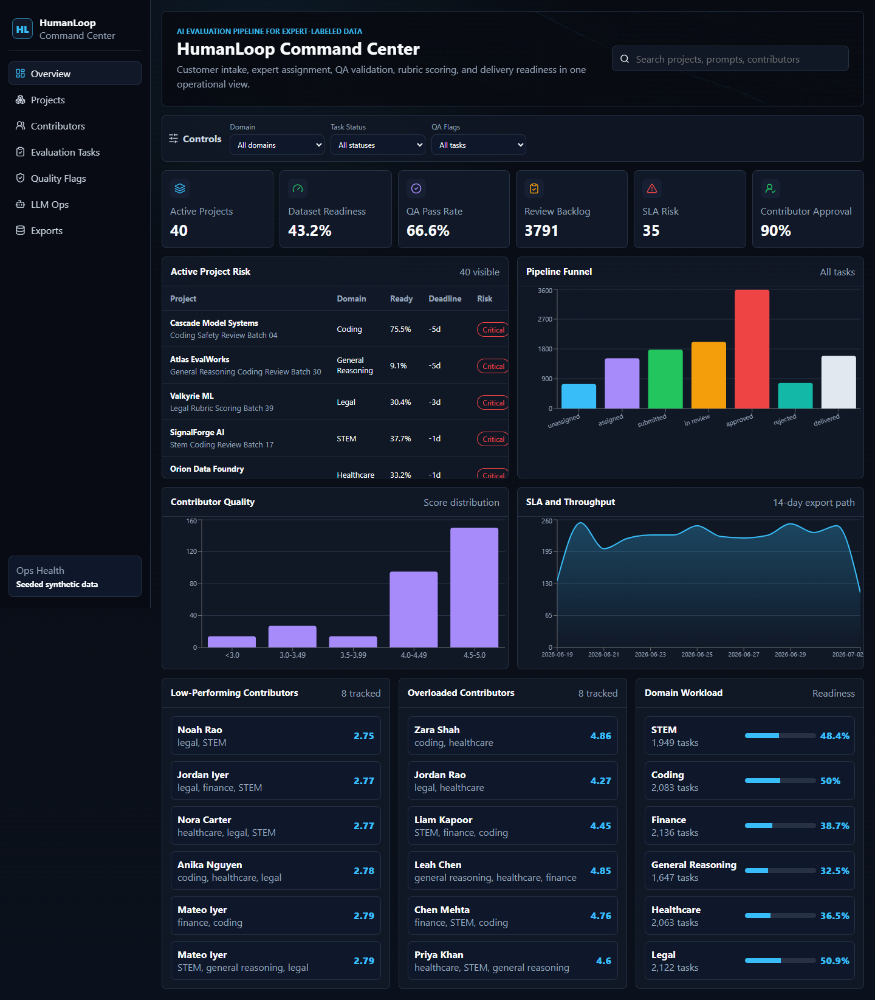
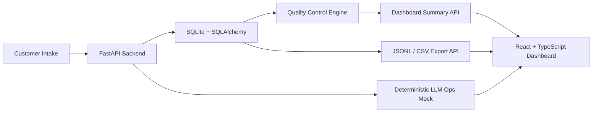

# HumanLoop Command Center

Live demo: [humanloop-command-center.vercel.app](https://humanloop-command-center.vercel.app) *(placeholder until deployment is connected)*

HumanLoop Command Center is a polished full-stack AI data operations dashboard for managing expert-labeled LLM evaluation pipelines. It simulates how an AI data operations team turns customer requirements into contributor assignments, rubric-scored tasks, QA validation, and delivery-ready datasets for frontier AI lab customers.

## Problem Statement

AI labs need high-quality human-labeled expert data to evaluate and improve frontier LLMs. The operational challenge is coordinating customer requirements, contributor expertise, labeling throughput, rubric quality, QA review, deadline risk, and final delivery formats without losing auditability. This command center gives operations teams one place to monitor readiness, quality, throughput, contributor performance, and SLA risk.

## Screenshots

Add final screenshots after running the local app:



## Architecture



## Tech Stack

- Frontend: React, TypeScript, Vite, Recharts, Lucide icons, Vanta.js Topology, clean CSS
- Backend: Python, FastAPI, SQLite, SQLAlchemy, Pydantic, pandas
- Data: deterministic synthetic seed with 40 projects, 300 contributors, 12,000 tasks, 25,000 rating events, and 1,000+ QA flags
- Exports: JSONL and CSV downloads from approved/delivered task rows

## Features

- Customer project intake model with domain, task type, target size, deadline, quality threshold, expertise, priority, and delivery format
- Contributor operations views for leaderboard, low performers, overloaded experts, coaching needs, and domain coverage gaps
- Evaluation task queue with status, project, domain, assigned contributor, final rating, rubric score, QA status, and flag count
- Quality flag dashboard grouped by missing ratings, duplicate prompts, inconsistent scoring, low-effort comments, contributor drift, fast submissions, high rejection rates, deadline risk, and threshold misses
- Analytics dashboard for active projects, dataset readiness, throughput, QA pass rate, review backlog, SLA risk, contributor approval, rejected tasks, delivery readiness, and domain workload
- LLM-assisted operations workflows using deterministic mock outputs for rubric drafts, delivery notes, and coaching recommendations
- Export-ready dataset workflow with JSONL and CSV download buttons
- Static demo-data fallback for frontend-only hosting

## Data Model

The core schema includes:

- `customers`
- `projects`
- `contributors`
- `contributor_training`
- `evaluation_tasks`
- `model_responses`
- `human_ratings`
- `rubric_scores`
- `qa_reviews`
- `quality_flags`
- `exports`
- `activity_logs`

See [schema.sql](schema.sql) and [data_dictionary.md](data_dictionary.md) for details.

## Local Setup

### Backend

```powershell
cd backend
python -m venv .venv
.\.venv\Scripts\Activate.ps1
pip install -r requirements.txt
python -m app.seed
uvicorn app.main:app --reload
```

The API runs at `http://127.0.0.1:8000`.

### Frontend

```powershell
cd frontend
npm install
npm run dev
```

The dashboard runs at `http://127.0.0.1:5173`.

The Vite dev server proxies `/api` to FastAPI. For hosted API usage, set `VITE_API_BASE_URL`.

## API Endpoints

| Endpoint | Method | Purpose |
|---|---:|---|
| `/health` | GET | API health check |
| `/api/projects` | GET | List customer projects with readiness and risk metrics |
| `/api/contributors` | GET | List expert contributors with quality, load, and coaching signals |
| `/api/tasks` | GET | List evaluation tasks with filters for domain, status, flags, contributor, and search |
| `/api/quality-flags` | GET | List validation and QA flags |
| `/api/dashboard/summary` | GET | Aggregated KPI, chart, and operations summary |
| `/api/projects/{id}/export?format=jsonl` | GET | Download approved/delivered rows as JSONL |
| `/api/projects/{id}/export?format=csv` | GET | Download approved/delivered rows as CSV |
| `/api/llm/rubric` | POST | Generate deterministic rubric draft from project intake fields |
| `/api/llm/delivery-notes` | POST | Draft customer delivery notes for a project |
| `/api/llm/contributor-issues` | GET | Summarize contributor quality and coaching issues |

## Validation Logic

The quality engine flags:

- Missing final human ratings
- Duplicate prompts
- Inconsistent rubric scores
- Low-effort reviewer comments
- Contributor drift
- Unusually fast submissions
- High rejection-rate contributors
- Projects at risk of missing deadline
- Datasets below quality threshold

## Deployment Notes

- Frontend: deploy `frontend/` to Vercel.
- Backend: deploy `backend/` to Render, Railway, Fly.io, or another Python API host.
- If a backend is not live, the frontend automatically falls back to `frontend/public/demo/*.json` so the dashboard still opens as a portfolio demo.
- Keep `.env`, virtual environments, cache files, node modules, and local SQLite databases out of Git.

## Resume Bullets

- Built HumanLoop Command Center, an AI data operations platform simulating expert-labeled LLM evaluation pipelines from customer intake to contributor assignment, rubric scoring, QA validation, and delivery-ready dataset export.
- Designed SQL data models and Python validation workflows across 12,000 evaluation tasks, 300 expert contributors, 40 customer projects, and 5 domain rubrics, surfacing SLA risk, QA pass rate, contributor quality, and dataset readiness in a React dashboard.
- Implemented LLM-assisted operations workflows to generate rubric drafts, summarize contributor quality issues, flag inconsistent ratings, draft customer delivery notes, and recommend coaching actions for low-performing contributors.

## Future Improvements

- Add authenticated customer and internal ops roles.
- Add Celery or background jobs for scheduled validation.
- Add reviewer calibration cohorts and cohort-level drift analysis.
- Add customer-specific rubric versioning.
- Store export artifacts in object storage with signed download links.
- Add Playwright end-to-end tests for dashboard filters, drawers, and export buttons.

