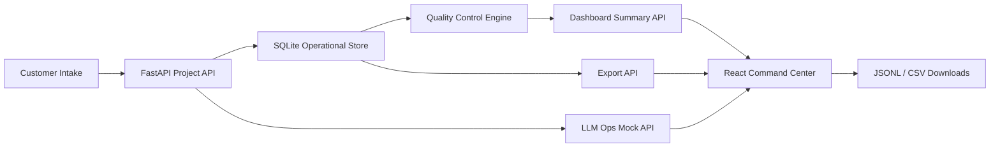

# Architecture

HumanLoop Command Center is a local-first full-stack portfolio project with a deterministic synthetic data generator.

## Backend

- `FastAPI` exposes project, contributor, task, quality-flag, dashboard, export, and LLM operations endpoints.
- `SQLAlchemy` defines the requested operational tables and relationships.
- `pandas` is used in the export path to produce CSV output from approved task rows.
- `backend/app/seed.py` generates reproducible data with a fixed seed and records a checksum in `activity_logs`.
- `backend/app/quality.py` centralizes readiness, risk, and quality-flag helper logic.

## Frontend

- `React + TypeScript + Vite` powers the dashboard.
- `Recharts` renders pipeline funnel, QA pass rate, throughput, quality distribution, and rejection reason charts.
- `Vanta.js Topology` runs only in the top command band and is cleaned up on component unmount.
- Static demo JSON in `frontend/public/demo` lets a deployed frontend remain usable if the backend is not hosted.

## Operational Flow

1. Customer project intake defines domain, task type, target size, deadline, quality threshold, expertise, priority, and delivery format.
2. Synthetic contributors are assigned by expertise, capacity, approval rate, rubric score, and current load.
3. Evaluation tasks move through `unassigned -> assigned -> submitted -> in review -> approved/rejected -> delivered`.
4. The quality engine flags missing ratings, duplicates, inconsistent scoring, low-effort comments, drift, fast submissions, deadline risk, and threshold misses.
5. Dashboard endpoints aggregate readiness, QA pass rate, backlog, SLA risk, contributor quality, domain workload, and export readiness.
6. Approved or delivered tasks can be exported as JSONL or CSV.

